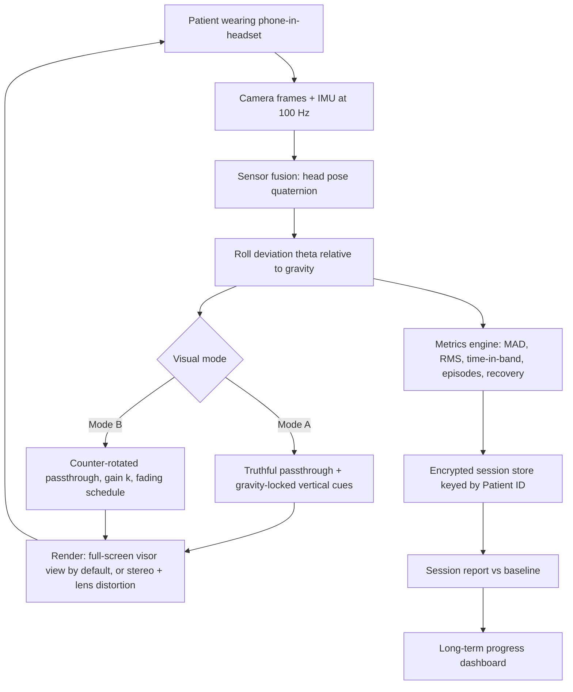
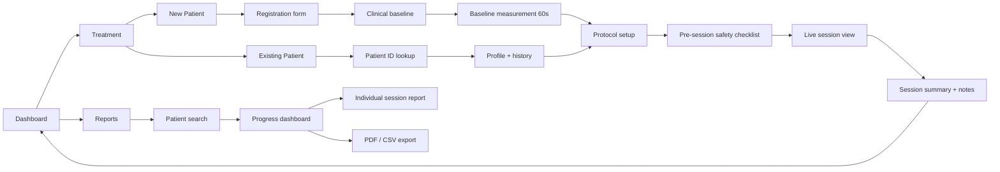

# Lateropulsion

**A phone-based VR/AR rehabilitation and measurement system for post-stroke lateropulsion (pusher syndrome).**

> `Open App → Treatment / Reports → Patient ID → Baseline → Rehabilitation Session → Measurements → Compare With Baseline → Session Report → Long-Term Progress`

---

## ⚠️ Status and intended use

| Item | Value |
|---|---|
| Project name | **Lateropulsion** (named after the condition it treats) |
| Package id | `com.lateropulsion.app` |
| Status | Pre-clinical prototype — **not a certified medical device** |
| Intended use | Clinician-supervised **rehabilitation aid and movement-measurement tool** |
| **Not** intended for | Diagnosis, triage, unsupervised home use, or replacing clinical judgement |
| Regulatory posture | Designed to IEC 62304 Class B / ISO 14971 from Phase 0 (see [Regulatory](#regulatory-and-quality-posture)) |

The clinician provides the diagnosis and the baseline severity grading. The application **measures orientation, delivers a visual intervention, and quantifies change**. It never outputs a diagnosis.

The full clinical architecture is (see [`docs/ARCHITECTURE.md`](./docs/ARCHITECTURE.md)):

```
Clinical Input → Sensor Input → Deviation Estimation → Visual Compensation
      → Guided Rehabilitation → Quantitative Measurement → Clinical Progress
```

---

## Table of contents

1. [Clinical background](#1-clinical-background)
2. [Scientific rationale and the core design decision](#2-scientific-rationale-and-the-core-design-decision)
3. [What the system does](#3-what-the-system-does)
4. [Doctor / nurse workflow](#4-doctor--nurse-workflow)
5. [Screen map](#5-screen-map)
6. [Exercise library](#6-exercise-library)
7. [Measured metrics](#7-measured-metrics)
8. [Clinical scales supported](#8-clinical-scales-supported)
9. [Technology stack](#9-technology-stack)
10. [Hardware requirements](#10-hardware-requirements)
11. [Repository layout](#11-repository-layout)
12. [Getting started](#12-getting-started)
13. [Configuration](#13-configuration)
14. [Data, privacy and security](#14-data-privacy-and-security)
15. [Safety, contraindications and stop rules](#15-safety-contraindications-and-stop-rules)
16. [Regulatory and quality posture](#16-regulatory-and-quality-posture)
17. [Roadmap](#17-roadmap)
18. [Glossary](#18-glossary)
19. [References](#19-references)

---

## 1. Clinical background

**Lateropulsion** — also called *pusher syndrome*, *contraversive pushing*, or *pusher behaviour* — is a disorder of postural control seen after stroke and some other central lesions. The patient actively pushes toward the hemiparetic (contralesional) side with the non-paretic limbs and **resists passive correction toward the true vertical**.

Key clinical facts that shape this product:

- Reported in roughly **10–60 %** of acute stroke admissions depending on the scale and cut-off used; more common with right-hemisphere and posterolateral thalamic / insular lesions.
- It is an independent predictor of **longer length of stay** and **slower functional recovery**, but most patients recover with targeted therapy within weeks to months.
- The patient's **internal sense of postural vertical (SPV)** is tilted — typically ~15–20° toward the ipsilesional side — while the **subjective visual vertical (SVV)** is often comparatively preserved.
- Therefore, conventional physiotherapy for lateropulsion is built around **giving the patient a reliable visual vertical reference** and training them to align to it, rather than manually forcing them upright.

The last two points are the entire reason a head-mounted visual system is a plausible intervention: **vision is the intact channel**, and a headset controls that channel completely.

---

## 2. Scientific rationale and the core design decision

The application supports **two visual paradigms**, and the therapist chooses per patient. This is a deliberate architectural decision, not a hedge.

### Mode A — Vertical Reference Augmentation (default, evidence-aligned)

The passthrough camera view is left **geometrically truthful**. On top of it the renderer draws a **gravity-locked vertical reference** (plumb line, horizon, framed grid, target column) that stays true regardless of head tilt. The patient's job is to align their head/trunk with a vertical they can *see*.

- Preserves the veridical vertical the patient still perceives correctly.
- Directly mirrors current best-practice physiotherapy (mirrors, door frames, vertical tape, visual-feedback training).
- Lowest risk of visual–vestibular conflict and cybersickness.
- **This is the default mode for all new patients.**

### Mode B — Compensated View (gain-based, experimental)

The passthrough view is **counter-rotated** by `k · θ`, where `θ` is the measured head roll and `k` is a therapist-set gain in `[0, 1]`. At `k = 1` the world appears upright even when the head is tilted; at `k = 0` the mode collapses to Mode A.

- Rationale: temporarily removes the visual consequence of tilt so the patient can attend to trunk/limb control, then the gain is **faded across sessions** (`k → 0`) so that control is handed back to the patient.
- Risk: rotating the visual world relative to gravity is exactly the conflict that produces cybersickness, and a permanently corrected view could *reinforce* the tilted postural set. **Gain fading is therefore mandatory, not optional** — the app refuses to run Mode B without a fading schedule.
- Also supports **negative gain (error augmentation)**, `k ∈ [-0.5, 0)`, where tilt is visually exaggerated to amplify error signal. Locked behind an "advanced protocol" flag.

> **Design rule:** the app must always be able to answer "what happens when the headset comes off?" The therapeutic goal is midline control *without* the device. Every protocol in the app is built around weaning off assistance.

---

## 3. What the system does



**Closed loop:** assess → measure deviation → deliver visual intervention → measure response → quantify change against the original baseline → repeat.

---

## 4. Doctor / nurse workflow

### 4.1 Main dashboard

Two primary actions only. Everything else is reachable from inside them.

```
┌──────────────────────────────────────────┐
│              LATEROPULSION               │
│                                          │
│   ┌────────────────┐  ┌────────────────┐ │
│   │   TREATMENT    │  │    REPORTS     │ │
│   │  Start / run   │  │  Look up by    │ │
│   │  a session     │  │  Patient ID    │ │
│   └────────────────┘  └────────────────┘ │
│                                          │
│   Today: 4 sessions · 3 patients         │
│   Device check: ✓ camera ✓ IMU ✓ battery │
└──────────────────────────────────────────┘
```

### 4.2 Treatment → New Patient

1. **Registration** — Patient ID (auto-generated, e.g. `LP-2026-0007`), name, age, sex, MRN, diagnosis, lesion side, date of onset, affected side, **lateropulsion direction (L/R)**, therapist/nurse, notes.
2. **Clinical baseline** — overall severity (Minimal / Mild / Moderate / Severe / Very Severe), head deviation (°), trunk deviation (°), sitting balance, standing balance, walking ability, assistance required, midline awareness, correction ability, fall risk. Optional structured scales (SCP, BLS, FAC, TCT, Berg).
3. **Baseline measurement** — headset on, seated, instruction *"Look straight ahead and hold."* 60 s capture with the correction **off**. The app records mean roll, RMS, drift and the tilt distribution. **This is the immutable reference point for every future session.**
4. **Start first session.**

### 4.3 Treatment → Existing Patient

1. Enter or scan Patient ID.
2. App retrieves profile, baseline, session history, last-used protocol, last gain `k`.
3. Pre-session checklist (safety, harness, headset hygiene, battery, thermal).
4. **Start New Session** — protocol pre-loaded from last session, therapist may override.

### 4.4 During the session

- Camera + IMU stream continuously; head pose computed at 100 Hz.
- Deviation from the patient's calibrated midline computed and displayed live on the **therapist mirror view** (phone screen is inside the headset, so the mirror view is cast to a tablet/second screen or reviewed after).
- Visual intervention rendered per selected mode.
- Guided exercise blocks with audio prompts and on-screen targets.
- Every sample and every event is written to an append-only session log.
- **Abort control** available at all times (therapist tap, Bluetooth clicker, or long-press) → instant neutral passthrough.

### 4.5 Session report

Generated automatically on stop, contains: current session measurements · baseline measurements · change from baseline · improvement percentage · checkpoint results · maximum/average deviation · midline-control metrics · exercise and total duration · gain schedule used · SSQ score · therapist observations · video/screenshots where captured. Saved permanently under the Patient ID.

### 4.6 Reports

Search by Patient ID → complete profile · baseline assessment · session history · session-by-session measurements · progress vs baseline · improvement trends · checkpoint results · previous reports · media and clinical notes. Exportable as **PDF** (clinical summary) and **CSV/JSON** (raw research data).

---

## 5. Screen map



---

## 6. Exercise library

Each exercise is a declarative **protocol block** (JSON) so new exercises need no app release.

| # | Exercise | Position | Goal | Primary metric | Progression gate |
|---|---|---|---|---|---|
| 1 | **Midline Training** | Supported sitting | Align head to visible vertical | Time-in-band ±5° | ≥ 60 % for 2 sessions |
| 2 | **Sitting Hold** | Unsupported sitting | Maintain upright trunk | RMS deviation, episodes | RMS ≤ 6° |
| 3 | **Weight Shift** | Sitting / standing | Controlled lateral excursion and return | Recovery time, symmetry index | Recovery ≤ 3 s |
| 4 | **Standing Hold** | Standing, parallel bars | Maintain midline in stance | Time-in-band ±10°, balance-loss events | ≥ 80 %, 0 losses |
| 5 | **Reach to Target** | Sitting or standing | Functional reach without pushing | Peak deviation during reach | Peak ≤ baseline − 30 % |
| 6 | **Walking to Target** | Gait, supervised | Straight-line ambulation | Path deviation, gait speed | Therapist judgement |
| 7 | **Functional Task** | Any | ADL simulation with visual feedback | Composite | Therapist judgement |
| 8 | **SVV Test** *(assessment, not exercise)* | Seated, static | Set a line to perceived vertical | SVV error (°), variance | n/a — assessment only |

Every exercise supports: duration, target angle, tolerance band, cue set (visual/audio/haptic), gain `k`, rest intervals, and **checkpoints** (timed snapshots written into the report).

---

## 7. Measured metrics

Sampled at 100 Hz, stored at 50 Hz, reported per block and per session.

### Head / posture
| Metric | Definition |
|---|---|
| `theta_now` | Instantaneous roll relative to gravity, corrected by calibration offset |
| `MAD` | Mean absolute deviation from target angle |
| `RMS` | Root-mean-square deviation |
| `theta_max` | Maximum absolute deviation |
| `theta_sd` | Standard deviation (steadiness) |
| `path_length` | ∫\|dθ\| — total angular travel, a sway proxy |
| `mean_velocity` | Mean \|dθ/dt\| |

### Midline control
| Metric | Definition |
|---|---|
| `TIB_5`, `TIB_10` | % of session time with \|θ\| ≤ 5° / ≤ 10° |
| `time_out_of_band` | Seconds outside the tolerance band |
| `episodes` | Count of deviation episodes (hysteresis: enter > 10°, exit < 7°, min 1.0 s) |
| `episode_mean_duration` | Mean episode length (s) |
| `episode_max_duration` | Longest single episode (s) |
| `recovery_time` | Mean time from episode onset to sustained return inside ±5° |
| `symmetry_index` | (mean deviation right − mean deviation left) / (sum) — quantifies directional bias |

### Functional
Walking path deviation · gait speed (when a stride estimate is available) · balance-loss events (therapist-marked or acceleration-spike detected) · assistance level (therapist-entered, 0 = independent → 3 = two-person).

### Derived
```
improvement_% = (baseline_MAD − session_MAD) / baseline_MAD × 100
```
Reported with confidence bounds and explicitly labelled **"internal progress metric — not a validated clinical outcome."** Clinical outcome remains SCP / BLS / FAC, entered by the clinician.

Exact formulas, filter design and edge cases: see [`ARCHITECTURE.md` §8](./docs/ARCHITECTURE.md).

---

## 8. Clinical scales supported

Entered by the clinician, stored alongside sensor data so device metrics can be validated against them.

| Scale | Purpose | Range |
|---|---|---|
| **SCP** — Scale for Contraversive Pushing | Gold-standard pusher-behaviour grading (posture, extension, resistance) | 0–6 |
| **BLS** — Burke Lateropulsion Scale | Graded across supine, sitting, standing, transfer, walking | 0–17 |
| **4PPS — Four-Point Pusher Score** | Rapid screening | 0–3 (four levels) |
| **FAC** — Functional Ambulation Categories | Walking assistance | 0–5 |
| **TCT** — Trunk Control Test | Trunk function | 0–100 |
| **Berg Balance Scale** | Balance | 0–56 |
| **PASS** | Postural assessment after stroke | 0–36 |
| **SSQ** — Simulator Sickness Questionnaire | VR tolerance / safety endpoint | derived |

Scale definitions live in `/config/scales/*.json` and are versioned; a session records which scale version was used.

---

## 9. Technology stack

| Layer | Choice | Why |
|---|---|---|
| Platform | **Android 10+ (API 29+), Kotlin** | Cheap phone-based HMDs, permissive camera/sensor access, dominant in Indian clinical settings |
| UI | Jetpack Compose + Material 3 | Fast clinician forms, large touch targets, accessibility |
| Camera | **Camera2 / CameraX** with low-latency `TEMPLATE_PREVIEW`, `SurfaceTexture` → external OES texture | Avoids ARCore's extra pipeline latency; direct GPU path |
| Sensors | `TYPE_GAME_ROTATION_VECTOR`, `TYPE_GRAVITY`, raw gyro + accel at 100–200 Hz | Game rotation vector avoids magnetometer drift indoors |
| Rendering | **OpenGL ES 3.2** (C++ / Kotlin JNI), custom stereo + barrel-distortion shader | Full control over motion-to-photon latency; no VR SDK lock-in |
| Fusion | Complementary filter + Madgwick fallback, in C++ | Deterministic, testable, low CPU |
| Persistence | **Room + SQLCipher** (AES-256), file store for media | Offline-first, encrypted at rest |
| Reports | Custom PDF renderer (`PdfDocument`) + MPAndroidChart/Compose canvas | No network dependency |
| Time series | Append-only binary log (`.lpx`) + Parquet/CSV export | Efficient at 50 Hz × long sessions |
| Backend *(optional, Phase 9)* | Kotlin/Ktor or FastAPI + PostgreSQL + S3-compatible object store, HL7 FHIR mapping | Multi-site studies, EMR interoperability |
| DI / arch | Hilt, Clean Architecture, Kotlin Coroutines + Flow | Testability, IEC 62304 traceability |
| Testing | JUnit5, Turbine, Robolectric, Espresso, MockK; hardware-in-the-loop rotary jig | Verification evidence |
| CI | GitHub Actions → lint, unit, instrumented (Firebase Test Lab), SBOM, signed build | Release traceability |

**Future targets:** iOS (ARKit + Metal), standalone passthrough HMDs (Quest 3 / Pico via **OpenXR**), Flutter clinician tablet companion.

---

## 10. Hardware requirements

### Phone (minimum → recommended)
| Spec | Minimum | Recommended |
|---|---|---|
| OS | Android 10 | Android 13+ |
| Display | 6.1", 60 Hz, 1080p | 6.4–6.7", 90–120 Hz, OLED |
| Camera2 level | `LIMITED` | `FULL` / `LEVEL_3`, 60 fps preview |
| Gyroscope | 100 Hz | 200 Hz+, low bias drift |
| GPU | OpenGL ES 3.1 | ES 3.2 / Vulkan |
| RAM | 4 GB | 8 GB |
| Thermal | — | vapour chamber (sustained camera + GL load is hot) |

### Headset and clinical kit
- Phone-based HMD with **adjustable IPD**, adjustable focal distance, and an **open bottom** (peripheral floor vision markedly reduces fall risk and sickness).
- Head strap with **quick-release**.
- **Gait belt / harness** and parallel bars or plinth for all standing and walking blocks.
- Non-slip mat, chair with arms, second person for standing work.
- Alcohol-free disinfectant wipes; single-use face-liner covers.
- Optional: Bluetooth clicker (abort + checkpoint marking), tablet for the therapist mirror view, tripod.

### Calibration rig (for verification, not clinical use)
Motorised or manual **rotary jig with a protractor** (≥ 0.5° resolution) to validate roll accuracy across ±40° — required evidence in Phase 2.

---

## 11. Repository layout

```
lateropulsion/
├── app/                          # Android application module (Compose UI, navigation)
│   └── src/main/kotlin/com/lateropulsion/app/
│       ├── ui/dashboard/         # Treatment | Reports
│       ├── ui/patient/           # Registration, baseline, lookup
│       ├── ui/session/           # Pre-check, live session, summary
│       ├── ui/reports/           # Progress dashboard, exports
│       └── di/
├── core/
│   ├── model/                    # Pure Kotlin domain entities (no Android deps)
│   ├── timeseries/               # .lpx append-only session log, crash recovery
│   ├── database/                 # Room + SQLCipher, DAOs, migrations
│   ├── datastore/                # Encrypted preferences, app settings
│   └── common/                   # Result types, dispatchers, clock, logging
├── feature/
│   ├── assessment/               # Scales (SCP, BLS, FAC…), baseline capture
│   ├── protocol/                 # Exercise definitions, protocol engine, gain schedules
│   ├── metrics/                  # Deviation metrics, episode detection, summaries
│   └── report/                   # PDF/CSV generation, chart rendering
├── engine/
│   ├── sensor/                   # IMU acquisition, fusion, calibration (Kotlin + JNI)
│   ├── vision/                   # Camera2 pipeline, frame timing, optional CV
│   └── render/                   # Kotlin/GLES passthrough renderer (visor or stereo), shaders, distortion mesh
│       └── src/main/cpp/shaders/
├── config/
│   ├── scales/                   # Versioned JSON scale definitions
│   ├── protocols/                # Versioned JSON exercise protocols
│   └── devices/                  # Per-phone/headset calibration profiles
├── docs/
│   ├── ARCHITECTURE.md
│   ├── IMPLEMENTATION.md
│   ├── STATUS.md                 # What is built, verified, and still open
│   ├── adr/                      # Decisions taken during implementation
│   ├── risk/                     # ISO 14971 hazard analysis, FMEA
│   ├── clinical/                 # Protocol, IRB/EC pack, ICF, CRF
│   └── traceability/             # Requirement ↔ test matrix (IEC 62304)
├── tools/
│   ├── jig/                      # Rotary-jig capture + accuracy analysis scripts
│   └── analysis/                 # Python notebooks for session data
└── backend/                      # Optional Phase 9 sync service (not yet present)
```

---

## 12. Getting started

### Prerequisites
- JDK 17, Android Studio Ladybug+, Android NDK r26+, CMake 3.22+
- A **physical Android device** (emulators have no usable IMU/camera pipeline)

### Build
```bash
git clone https://github.com/<org>/lateropulsion.git
cd lateropulsion

cp local.properties.example local.properties   # set sdk.dir / ndk.dir
./gradlew :app:assembleDebug
./gradlew installDebug
```

### Run the test suites
```bash
./gradlew test                       # unit: metrics, fusion math, protocol engine
./gradlew connectedAndroidTest       # instrumented: DB, camera, render smoke tests
python3 tools/jig/analyse.py jig/<model>/   # hardware-in-the-loop accuracy from a jig capture
```


### Developing from WSL2 (Ubuntu on Windows)
USB devices belong to Windows, so the Linux `adb` sees nothing. Either:
- use the Windows platform-tools through the shim `tools/dev/adb` (it finds `adb.exe` and translates WSL paths), e.g. `tools/dev/adb install -r app/build/outputs/apk/clinical/debug/app-clinical-debug.apk`, or
- attach the phone to WSL with [usbipd-win](https://github.com/dorssel/usbipd-win): `usbipd list`, `usbipd bind --busid <id>`, `usbipd attach --wsl --busid <id>`, then the Linux `adb` works directly, or
- enable Wireless debugging on the phone and `adb pair` / `adb connect <ip>:<port>` from WSL.

Gradle's `installDebug` uses the Linux adb; from WSL prefer `./gradlew :app:assembleClinicalDebug` followed by the shim install.

### First run
1. Create a clinician account (local, PIN + optional biometric).
2. **Settings → Device Profile → Calibrate**: run the lens/IPD calibration and the roll-sign calibration (see [`ARCHITECTURE.md` §6](./ARCHITECTURE.md)).
3. **Settings → Safety**: confirm max session duration, abort control, and supervision attestation.
4. Dashboard → Treatment → New Patient.

---

## 13. Configuration

`config/app.json` (overridable per site):

```json
{
  "session": {
    "max_duration_min": 20,
    "default_block_duration_s": 120,
    "mandatory_rest_every_s": 300,
    "auto_stop_on_ssq_flag": true
  },
  "visual": {
    "default_mode": "VERTICAL_REFERENCE",
    "gain_initial": 0.6,
    "gain_min": 0.0,
    "gain_fade_rule": "PERFORMANCE_DRIVEN",
    "gain_fade_step": 0.1,
    "gain_fade_gate_tib5": 60.0,
    "allow_error_augmentation": false
  },
  "metrics": {
    "sample_rate_hz": 100,
    "store_rate_hz": 50,
    "lowpass_cutoff_hz": 5.0,
    "band_primary_deg": 5.0,
    "band_secondary_deg": 10.0,
    "episode_enter_deg": 10.0,
    "episode_exit_deg": 7.0,
    "episode_min_duration_s": 1.0
  },
  "safety": {
    "require_supervision_attestation": true,
    "require_harness_for_standing": true,
    "walking_unlock_requires_standing_pass": true,
    "motion_to_photon_abort_ms": 60
  },
  "privacy": {
    "media_capture_default": "off",
    "retention_days": 1825,
    "export_deidentified_by_default": true
  }
}
```

---

## 14. Data, privacy and security

- **Offline-first.** No network permission is required for the clinical build. Sync is a separate, opt-in flavour.
- **Encryption at rest:** SQLCipher AES-256; keys in the Android Keystore (StrongBox where available), unlocked by clinician PIN/biometric. Media files encrypted with per-file keys.
- **Identity separation:** identifiers (name, MRN) live in a separate table from the time-series data, joined only by an internal UUID. Research exports carry the UUID and a study code, never the name.
- **Screen lock:** `FLAG_SECURE` on all patient screens; no screenshots, no content in the recents thumbnail.
- **Audit log:** append-only record of who opened, edited, exported or deleted what, with timestamps — a hard requirement under IEC 62304 and hospital IT policy.
- **Media:** video/screenshots are **off by default**, require an explicit consent flag on the patient record, and are stored encrypted with a separate retention timer.
- **Applicable law:** India **DPDP Act 2023** (primary for the initial deployment), plus GDPR / HIPAA where relevant. Consent, purpose limitation, retention, erasure and breach-notification workflows are all first-class features, not afterthoughts.
- **Data deletion:** patient erasure removes identifiers and media, optionally retaining fully de-identified time series if the consent form allowed research reuse — the choice is recorded.

---

## 15. Safety, contraindications and stop rules

**This system occludes vision in a population with impaired balance. Safety design outranks every other requirement.**

### Absolute rules
1. **Never** used without a trained clinician physically present and within arm's reach.
2. **Never** in free-standing or walking blocks without a gait belt and parallel bars/harness.
3. Sitting blocks are mandatory before standing blocks; standing exit criteria are mandatory before walking blocks. The app **enforces** this ordering.
4. Instant abort available at all times → neutral passthrough within one frame, audio prompt to the therapist.
5. Hard session cap (default 20 minutes of headset time), mandatory rest every 5 minutes.

### Relative contraindications (screening prompts in-app)
Uncontrolled seizure disorder / photosensitive epilepsy · severe visual impairment or diplopia the headset cannot accommodate · acute vestibular crisis with intractable vomiting · unstable cardiovascular status · open facial wounds or infection · severe agitation or inability to follow instruction · reduced consciousness (GCS below site threshold) · recent ocular surgery.

### Stop rules (any one → stop the block)
Nausea reported or observed · dizziness increasing · pallor/sweating · SSQ score above site threshold · headache · balance loss · patient asks to stop · therapist judgement · device thermal warning · frame timing exceeds the abort threshold (a stuttering passthrough view is a sickness and fall hazard).

### Cybersickness management
Start with Mode A only. Introduce Mode B seated only, `k ≤ 0.4`, ≤ 3 minutes. Record SSQ before and after every session for the first five sessions. Any patient with two consecutive flagged SSQ scores is switched permanently to Mode A.

---

## 16. Regulatory and quality posture

Even as a research prototype, build to the standards you will eventually be audited against — retrofitting is far more expensive.

| Standard / regulation | Application |
|---|---|
| **IEC 62304** | Software lifecycle. Provisional **Class B** (non-life-threatening injury possible — falls). Requires architecture, unit verification, SOUP list, and traceability from requirement → design → test. |
| **ISO 14971** | Risk management file: hazard analysis, FMEA, risk-control verification. Started in Phase 0, updated every phase. |
| **IEC 62366-1** | Usability engineering — critical here, because a mis-set gain or a skipped harness check is a *use error* with a physical consequence. |
| **ISO 13485** | QMS, once the project moves toward commercialisation. |
| **India CDSCO — MDR 2017** | Software as a medical device; likely **Class B**. Registration route and test-licence requirements to be confirmed with a regulatory consultant in Phase 0. |
| **EU MDR 2017/745, Rule 11** | Would likely be **Class IIa** in the EU. |
| **US FDA** | Likely Class II (510(k)) as a powered exercise/biofeedback device — general-wellness exemption is **not** available given the clinical claims. |
| **ISO 14155 / ICH-GCP** | Clinical investigation conduct. |
| **Ethics** | Institutional Ethics Committee approval + **CTRI registration** before any patient use in India. Informed consent, with a separate consent item for video. |

The SOUP (software of unknown provenance) list — every third-party library with version, purpose and known-anomaly review — lives at `docs/traceability/soup.md` and is a release gate.

---

## 17. Roadmap

See **[`docs/IMPLEMENTATION.md`](./docs/IMPLEMENTATION.md)** for the full phase-by-phase plan and **[`docs/STATUS.md`](./docs/STATUS.md)** for what is implemented today. Summary:

| Phase | Theme | Duration |
|---|---|---|
| 0 | Discovery, clinical protocol, risk file | 3 weeks |
| 1 | Foundation: data layer, patient/baseline flows | 4 weeks |
| 2 | Sensor and pose engine + jig verification | 3 weeks |
| 3 | Stereo passthrough renderer + visual correction | 4 weeks |
| 4 | Protocol/exercise engine + real-time feedback | 4 weeks |
| 5 | Metrics engine + session reports | 3 weeks |
| 6 | Reports module + long-term progress | 3 weeks |
| 7 | Safety, security, usability hardening | 4 weeks |
| 8 | Bench + clinical feasibility pilot | 8–12 weeks |
| 9 | Scale: sync, FHIR, multi-site, ML | ongoing |

---

## 18. Glossary

| Term | Meaning |
|---|---|
| **Lateropulsion / pusher syndrome** | Active pushing toward the paretic side with resistance to passive correction |
| **Contraversive** | Directed toward the side opposite the brain lesion |
| **SPV** | Subjective postural vertical — the internal sense of body upright |
| **SVV** | Subjective visual vertical — perceived vertical of a seen line |
| **Roll (θ)** | Rotation about the naso-occipital axis; the lateral head tilt this system measures |
| **Gain (k)** | Fraction of measured tilt that is visually compensated in Mode B |
| **Gain fading** | Progressive reduction of `k` toward 0 across sessions |
| **Time-in-band** | Percentage of time within a tolerance angle of the target |
| **Episode** | A contiguous period of deviation beyond threshold, with hysteresis |
| **Motion-to-photon** | Latency from head movement to the corresponding pixels being displayed |
| **SOUP** | Software of unknown provenance (third-party code), per IEC 62304 |
| **HMD** | Head-mounted display |

---

## 19. References

Background reading to be captured formally in `docs/clinical/literature.md`. Core areas:

1. Karnath et al. — the origin of contraversive pushing and the **Scale for Contraversive Pushing (SCP)**; thalamic/insular lesion correlates.
2. D'Aquila et al. — the **Burke Lateropulsion Scale (BLS)**, validity and reliability.
3. Pérennou et al. — subjective postural vertical vs subjective visual vertical in pushing behaviour; the "graviceptive" account.
4. Babyar et al. — prevalence, recovery trajectory and predictors after stroke.
5. Barra et al. — vestibular and multisensory contributions to postural vertical.
6. Reviews of visual-feedback and VR-based balance therapy after stroke; effect sizes and quality of evidence.
7. Kennedy et al. — **Simulator Sickness Questionnaire**, and current cybersickness literature for passthrough AR.

> Each claim in the clinical rationale must be cited to primary literature before any ethics submission. Verify prevalence figures, SPV tilt magnitudes and recovery timelines against current sources — the ranges quoted in §1 are indicative and vary substantially by cohort and measurement scale.

---

## License and contributions

Choose a licence deliberately: a permissive licence (Apache-2.0) accelerates academic collaboration, while a copyleft or proprietary licence may be needed for a regulated commercial route. Until decided, treat the repository as **all rights reserved**.

Contribution rules, code review requirements and the definition of done are in [`docs/IMPLEMENTATION.md`](./docs/IMPLEMENTATION.md).
