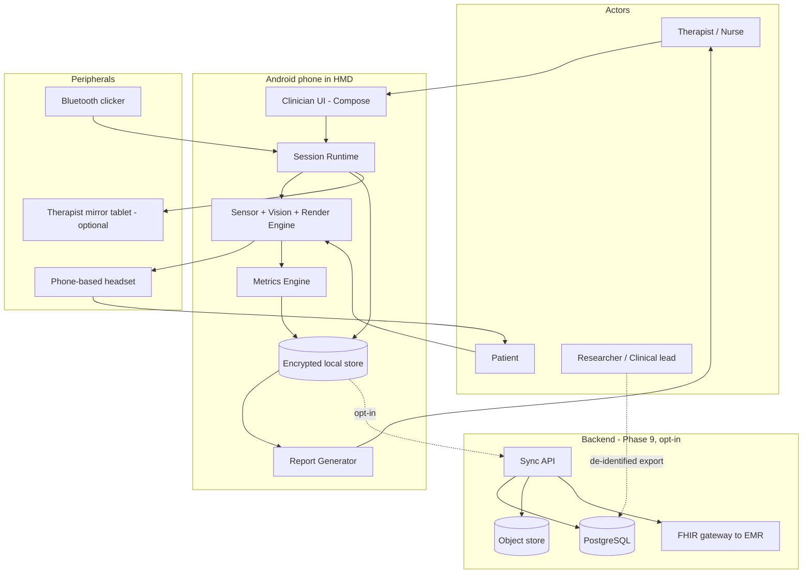
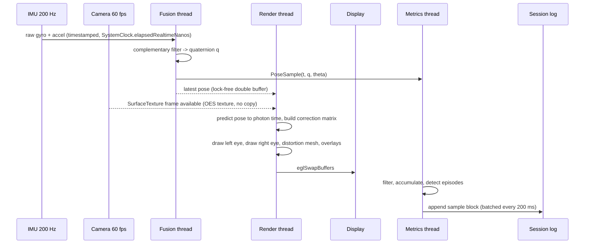
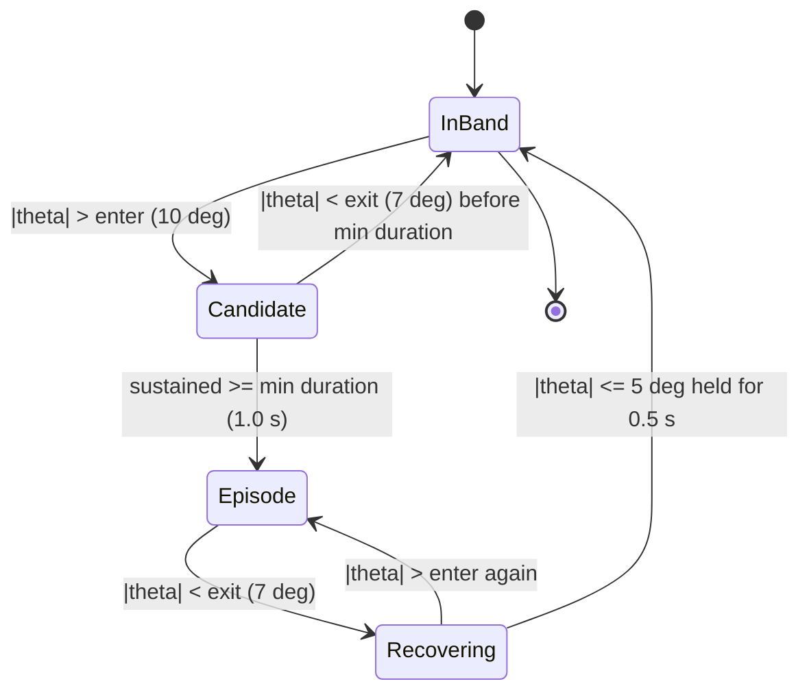
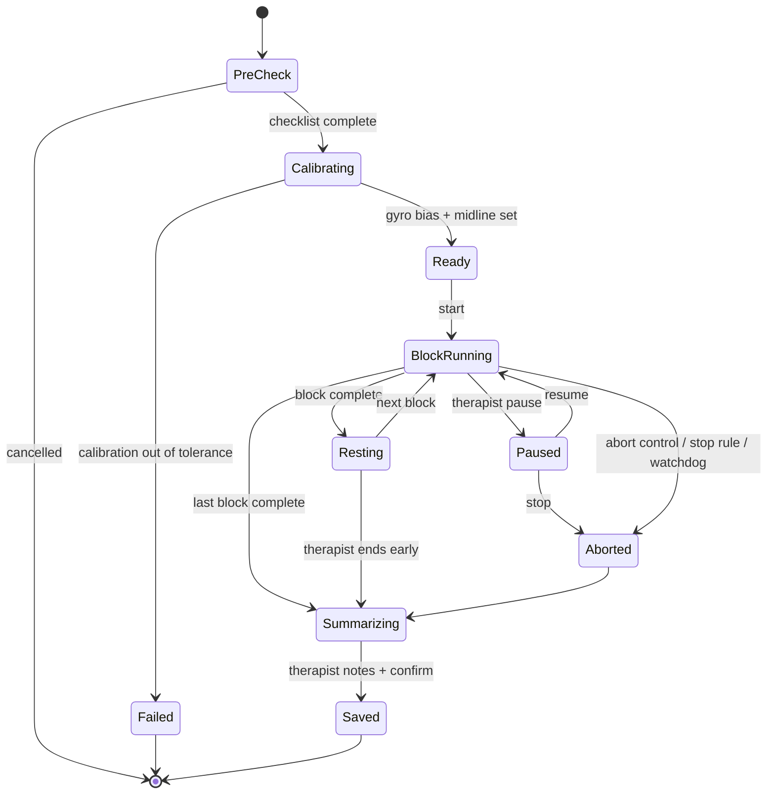
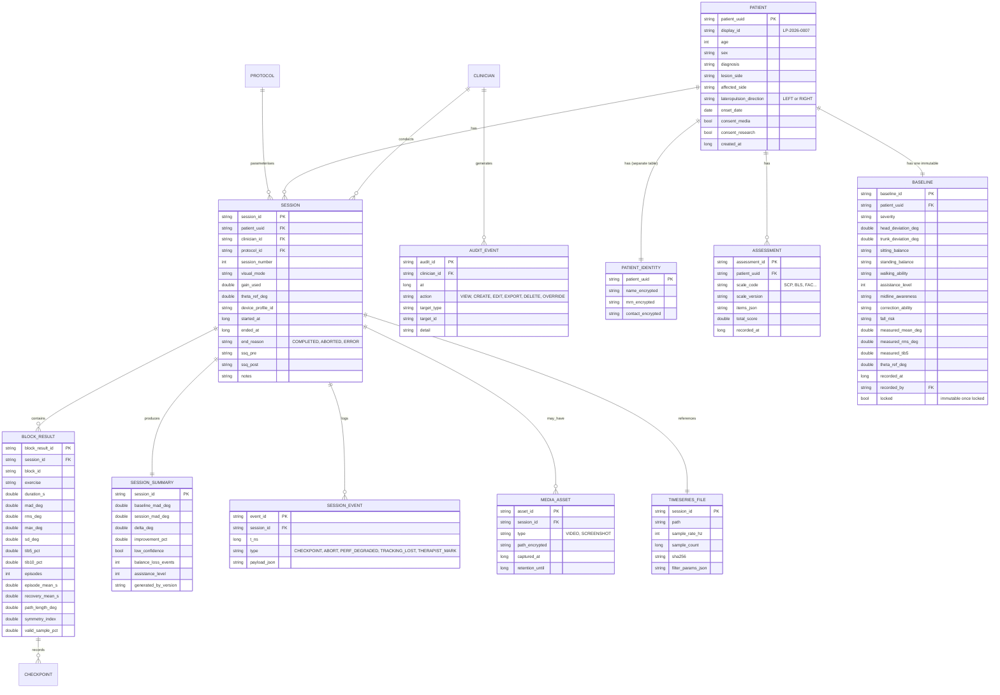

# Lateropulsion — System Architecture

Companion to [`README.md`](./README.md). This document specifies *how* the system is built: layers, modules, the real-time pipeline, the maths, the data model, security, and verification hooks.

---

## Contents

1. [Architectural drivers](#1-architectural-drivers)
2. [Context and container view](#2-context-and-container-view)
3. [Layered architecture](#3-layered-architecture)
4. [Module catalogue](#4-module-catalogue)
5. [Real-time pipeline and latency budget](#5-real-time-pipeline-and-latency-budget)
6. [Coordinate frames, pose maths and calibration](#6-coordinate-frames-pose-maths-and-calibration)
7. [Visual correction and rendering](#7-visual-correction-and-rendering)
8. [Metrics engine](#8-metrics-engine)
9. [Protocol / exercise engine](#9-protocol--exercise-engine)
10. [Data model](#10-data-model)
11. [Storage, time series and file formats](#11-storage-time-series-and-file-formats)
12. [Report generation](#12-report-generation)
13. [Optional backend and interoperability](#13-optional-backend-and-interoperability)
14. [Security architecture](#14-security-architecture)
15. [Failure modes and defensive design](#15-failure-modes-and-defensive-design)
16. [Performance targets](#16-performance-targets)
17. [Test architecture](#17-test-architecture)
18. [Extensibility and portability](#18-extensibility-and-portability)
19. [Architecture decision records](#19-architecture-decision-records)

---

## 1. Architectural drivers

Ranked. When two drivers conflict, the higher one wins.

| # | Driver | Architectural consequence |
|---|---|---|
| 1 | **Patient safety** | Abort path bypasses all business logic; render thread has a watchdog; unsafe states are unrepresentable in the protocol state machine |
| 2 | **Low motion-to-photon latency** | Direct Camera2 → GPU texture path; no bitmap copies; no ARCore; render on a dedicated thread with `Choreographer` |
| 3 | **Measurement validity** | Raw sensor data stored unfiltered and immutable; every filter is explicit, versioned and reproducible offline |
| 4 | **Offline operation** | No network on the critical path; all data local and encrypted; sync is an optional flavour |
| 5 | **Regulatory traceability** | Clean layering, pure domain logic, requirement IDs in test names, SOUP list |
| 6 | **Clinician usability** | Two-tap entry to any task; large targets; no destructive action without confirmation |
| 7 | **Extensibility** | Exercises and scales are data, not code |

---

## 2. Context and container view



---

## 3. Layered architecture

Strict dependency direction: **outer depends on inner, never the reverse.**

```
┌────────────────────────────────────────────────────────────┐
│  PRESENTATION      Compose screens, ViewModels, navigation │
├────────────────────────────────────────────────────────────┤
│  APPLICATION       Use cases: StartSession, CaptureBaseline│
│                    ComputeSessionSummary, ExportReport     │
├────────────────────────────────────────────────────────────┤
│  DOMAIN            Pure Kotlin. Patient, Assessment,       │
│                    Protocol, Metrics maths, Gain schedule. │
│                    NO Android imports. 100 % unit-testable │
├────────────────────────────────────────────────────────────┤
│  DATA              Room DAOs, SQLCipher, file store,       │
│                    config loaders, repositories            │
├────────────────────────────────────────────────────────────┤
│  ENGINE / PLATFORM Camera2, SensorManager, GLES renderer,  │
│                    JNI fusion, PDF, Keystore               │
└────────────────────────────────────────────────────────────┘
```

**Rule:** all deviation maths, episode detection, gain scheduling and improvement calculations live in `core/model` + `feature/metrics` as pure functions. That is what makes them provable in a unit test and reproducible in an offline analysis script — a regulatory requirement, not a style preference.

---

## 4. Module catalogue

| Module | Responsibility | Key types | Depends on |
|---|---|---|---|
| `core:model` | Domain entities and pure maths | `Patient`, `Baseline`, `SessionSpec`, `PoseSample`, `DeviationMetrics`, `GainSchedule` | — |
| `core:common` | Result/Either, dispatchers, `Clock`, structured logging, ID generation | `Outcome<T>`, `MonotonicClock` | — |
| `core:database` | Room + SQLCipher schema, DAOs, migrations, audit log | `LpDatabase`, `PatientDao`, `SessionDao`, `AuditDao` | model, common |
| `core:datastore` | Encrypted settings, device profile, feature flags | `DeviceProfile`, `AppConfig` | common |
| `engine:sensor` | IMU acquisition, fusion, calibration, drift monitoring | `PoseProvider`, `ImuSource`, `RollEstimator`, `CalibrationStore` | common |
| `engine:vision` | Camera2 session, frame timing, exposure lock, optional CV markers | `CameraSource`, `FrameClock` | common |
| `engine:render` | GLES stereo renderer, distortion mesh, overlay layer, abort path | `StereoRenderer`, `CorrectionTransform`, `OverlayPainter` | sensor, vision |
| `feature:assessment` | Scales, baseline capture flow, SVV test | `ScaleDefinition`, `BaselineCapture` | model, database |
| `feature:protocol` | Exercise definitions, block sequencing, progression gates, gain fading | `ProtocolEngine`, `BlockState`, `ProgressionGate` | model, metrics |
| `feature:metrics` | Streaming and batch metric computation, episode detection | `MetricsAccumulator`, `EpisodeDetector`, `SessionSummarizer` | model |
| `feature:report` | PDF/CSV/JSON generation, charts, baseline comparison | `SessionReportBuilder`, `ProgressReportBuilder` | model, database |
| `app` | Screens, navigation, DI wiring, permissions, lifecycle | — | all |

---

## 5. Real-time pipeline and latency budget



### Threading model
| Thread | Work | Priority |
|---|---|---|
| Render (`HandlerThread` + EGL) | GL draw, texture update, distortion, overlays | `THREAD_PRIORITY_URGENT_DISPLAY` |
| Sensor/fusion | IMU callbacks, filter, pose publication | `THREAD_PRIORITY_URGENT_AUDIO` |
| Camera | Camera2 callbacks, timing telemetry | default+ |
| Metrics | Filtering, accumulation, episode detection | background |
| IO | Log flush, encryption, media write | background, batched |
| Main | UI only. **Never** touched by the real-time path | — |

Pose is handed to the renderer through a lock-free triple buffer. **No allocation in the render or fusion loop** — pre-allocated pools only, verified by an allocation-tracking test.

### Latency budget (target ≤ 45 ms motion-to-photon; abort above 60 ms)

| Stage | Target | Notes |
|---|---|---|
| Sensor sampling + fusion | ≤ 5 ms | 200 Hz IMU, filter is O(1) |
| Camera exposure + readout | 12–20 ms | fix exposure/AE-lock; prefer 60 fps preview mode |
| Frame → GPU texture | ≤ 2 ms | `SurfaceTexture` external OES, zero copy |
| GL draw (stereo + distortion) | ≤ 6 ms | single pass per eye, no post FX |
| Compositor + display scanout | 8–16 ms | 90–120 Hz panels halve this |
| **Total** | **≈ 33–49 ms** | measured, not assumed — see §17 |

**Pose prediction:** the renderer extrapolates the pose forward by the measured photon latency using angular velocity, `q_pred = q ⊗ exp(½ ω Δt)`, clamped to 50 ms. This is what makes the overlay feel locked to the world rather than swimming.

**Watchdog:** if three consecutive frames exceed the abort threshold, the renderer drops to neutral passthrough, raises an audible therapist alert, and the session marks a `PERF_DEGRADED` event in the log.

---

## 6. Coordinate frames, pose maths and calibration

### 6.1 Frames

| Frame | Definition |
|---|---|
| **World (W)** | Gravity-aligned. `+Y_w` = up (opposite gravity). Heading is irrelevant to this application. |
| **Device (D)** | Android convention with the phone in portrait: `+X_d` right of the screen, `+Y_d` toward the top, `+Z_d` out of the screen toward the viewer. |
| **Head (H)** | Assumed rigidly coupled to the device by the headset; `R_HD` from the device profile (accounts for mount tilt). |
| **Patient midline (M)** | Head frame rotated by the calibration offset `θ_ref`, so that `θ = 0` corresponds to the patient's *therapeutically defined* upright. |

Rigid coupling is an assumption with a real error term — headsets slip. Mitigation in §15.

### 6.2 Roll extraction (the primary clinical signal)

With normalised gravity in the device frame `g = (g_x, g_y, g_z)`:

```
θ_raw = atan2(g_x, g_y)             // radians, rotation about the line of sight
θ_head = s · θ_raw + θ_mount        // s ∈ {+1, −1} from calibration; θ_mount from device profile
θ = θ_head − θ_ref                  // deviation from the patient's calibrated midline
```

Clinical sign convention: **θ > 0 = tilt toward the patient's right.** The sign constant `s` is *determined empirically per device profile during calibration*, never assumed, because vendor sensor axes and headset mounting differ. A calibration that cannot resolve `s` unambiguously blocks session start.

Validity guard: when `|g_z|` is large (patient looking far up or down), roll about the line of sight becomes ill-conditioned. Samples with `|g_z| > 0.85` are flagged `PITCH_OUT_OF_RANGE`, excluded from midline metrics, and surfaced to the therapist as a cue to re-instruct the patient.

### 6.3 Fusion

```
q_k = normalize( (1−α) · (q_{k−1} ⊗ Δq_gyro) + α · q_accel_correction )
```

- Gyro integrates at 200 Hz for responsiveness; the accelerometer supplies the low-frequency gravity reference. `α ≈ 0.02` at 200 Hz (≈ 0.4 s time constant).
- **Magnetometer deliberately excluded** — indoor ferrous interference in hospital rooms causes yaw jumps, and yaw is irrelevant to lateropulsion measurement.
- Gyro bias estimated during a 3 s stillness window at session start; drift monitored continuously. Drift beyond 0.5°/min raises a re-calibration prompt.
- `TYPE_GAME_ROTATION_VECTOR` is used as a cross-check; a persistent disagreement > 3° between the vendor fusion and the in-app filter logs a `FUSION_DISAGREEMENT` event.

### 6.4 Calibration procedures

| Calibration | When | Procedure | Stored in |
|---|---|---|---|
| **Device profile** | Once per phone + headset model | Rotary jig sweep ±40° in 5° steps; solve for `s`, `θ_mount`, scale error, and residual RMS. Rejects if RMS > 1.0° | `config/devices/<model>.json` |
| **Lens/IPD** | Per headset unit, per patient if IPD differs | Interactive: adjust until the two eye images fuse; sets viewport separation and distortion coefficients | Device profile + patient record |
| **Gyro bias** | Every session start | 3 s static hold, phone on a flat surface or on the patient's stationary head | Session record |
| **Patient midline `θ_ref`** | At baseline; re-checked each session | Therapist positions the patient at their clinical upright and taps *Set Midline*. Stored with a timestamp and the therapist ID | Baseline / session record |

> **`θ_ref` is a clinical judgement, and the app records it as such.** It is never silently re-derived from the patient's own posture — doing so would define the tilted posture as "correct" and quietly invalidate every metric.

---

## 7. Visual correction and rendering

### 7.1 Render graph

```
Camera OES texture
   │
   ├─► [Left eye pass]  ── correction matrix ──► viewport L ──┐
   │                                                          ├─► distortion mesh ──► framebuffer
   ├─► [Right eye pass] ── correction matrix ──► viewport R ──┘
   │
   └─► [Overlay pass] gravity-locked cues drawn in world space, projected per eye
```

### 7.2 Correction transform (Mode B)

Applied to the camera **texture coordinates** about the optical centre of each eye:

```glsl
// fragment shader (simplified)
uniform samplerExternalOES uCamera;
uniform float uK;          // gain, 0..1  (negative allowed only in advanced mode)
uniform float uTheta;      // predicted head roll, radians
uniform vec2  uCenter;     // optical centre for this eye, in texture space
uniform float uShift;      // optional lateral prism-like offset, texture units
uniform float uAspect;

varying vec2 vTex;

void main() {
    float a = -uK * uTheta;              // counter-rotation
    float c = cos(a), s = sin(a);
    vec2 p = vTex - uCenter;
    p.x *= uAspect;                      // work in an isotropic space
    vec2 r = vec2(c * p.x - s * p.y,
                  s * p.x + c * p.y);
    r.x /= uAspect;
    r += uCenter;
    r.x += uShift;

    // outside the valid camera region, show neutral grey rather than
    // stretched edge pixels - clamped smear is a nausea trigger
    if (r.x < 0.0 || r.x > 1.0 || r.y < 0.0 || r.y > 1.0) {
        gl_FragColor = vec4(0.12, 0.12, 0.13, 1.0);
    } else {
        gl_FragColor = texture2D(uCamera, r);
    }
}
```

Rotating a rectangular frame leaves empty corners. Two mitigations, both configurable: **(a) over-scan** — capture wider than displayed (crop factor 1.15–1.25) so rotation up to ~20° never exposes an edge; **(b) neutral fill** — flat grey, never a mirrored or smeared edge.

Rate limiting: `k·θ` is slew-limited (default 30°/s) so a sudden head jerk cannot produce a violent whole-field rotation.

### 7.3 Gain scheduling

```kotlin
sealed interface GainSchedule {
    fun nextGain(history: List<SessionSummary>, current: Double): Double

    /** Fixed decrement each session. Simple, predictable, therapist-friendly. */
    data class Linear(val step: Double, val floor: Double = 0.0) : GainSchedule

    /** Reduce only when the patient has earned it. Default. */
    data class PerformanceDriven(
        val step: Double = 0.10,
        val gateTib5: Double = 60.0,       // % time within ±5°
        val consecutiveSessions: Int = 2,
        val floor: Double = 0.0
    ) : GainSchedule

    /** Therapist sets k manually every session; requires a written rationale. */
    data object Manual : GainSchedule
}
```

Invariants enforced by the engine, not by the UI:
- Mode B cannot start without a schedule other than `Manual`, unless an "advanced protocol" flag is set on the patient record.
- `k` can never *increase* between sessions by more than one step without a therapist note.
- The report always plots `k` alongside deviation, so improvement is never read without knowing how much help was being given. **A falling deviation with a constant high gain is not progress, and the report says so.**

### 7.4 Overlay cues (Mode A and B)

All drawn **gravity-locked**, i.e. rotated by `−θ_head` so they remain true vertical on the retina:

| Cue | Purpose |
|---|---|
| Plumb line | Continuous vertical reference through the centre of the field |
| Horizon bar | Horizontal reference; strong cue for lateral tilt |
| Tolerance band | Shaded ±5° / ±10° wedge; turns green inside band |
| Target column / reach target | Task goal for reach and walking blocks |
| Deviation readout | Numeric degrees + direction arrow (therapist-toggleable; hidden for patients who fixate on numbers) |
| Progress ring | Time remaining in the block |
| Audio pan cue | Tone panned toward the tilt direction; loudness proportional to `|θ|` — useful for patients with visual neglect |
| Haptic cue | Short pulse on band exit and on return |

Cue sets are per-exercise configuration, so a hemianopia or neglect patient can be given an audio-weighted set without code changes.

---

## 8. Metrics engine

### 8.1 Signal conditioning

```
raw θ (100 Hz) ──► validity mask ──► 4th-order zero-phase Butterworth LPF, fc = 5 Hz
                                        │
                                        ├──► metrics (filtered)
                                        └──► stored raw + filter params for reproducibility
```

Zero-phase (forward–backward) filtering is used for **offline/summary** metrics only. The **live** display uses a causal 2nd-order filter with documented group delay, because you cannot filter acausally in real time and pretending otherwise would misreport latency.

### 8.2 Core formulas

Let `θ_i` be N valid samples over a block with target `θ_t` (usually 0) and sample period `Δt`:

```
MAD          = (1/N) Σ |θ_i − θ_t|
RMS          = sqrt( (1/N) Σ (θ_i − θ_t)² )
θ_max        = max |θ_i − θ_t|
θ_sd         = sqrt( (1/(N−1)) Σ (θ_i − θ̄)² )
TIB_b        = 100 · |{ i : |θ_i − θ_t| ≤ b }| / N
path_length  = Σ |θ_i − θ_{i−1}|
mean_velocity= path_length / (N·Δt)
symmetry     = ( Σ_{θ_i>0} θ_i + Σ_{θ_i<0} θ_i ) / Σ |θ_i|      // −1 = all left, +1 = all right
```

### 8.3 Episode detection (hysteresis state machine)



- `recovery_time` = time from episode onset to the `Recovering → InBand` transition.
- Episodes overlapping a `PITCH_OUT_OF_RANGE` or `TRACKING_LOST` region are marked `partial` and excluded from means, but still counted and shown — silently dropping them would flatter the results.

### 8.4 Baseline comparison

```
Δ            = session_MAD − baseline_MAD
improvement% = 100 · (baseline_MAD − session_MAD) / baseline_MAD
```

Guards that the report enforces:
- Both values must come from the **same exercise type and body position**. Comparing a supported-sitting baseline to a standing session is meaningless and is refused.
- Sessions shorter than 60 s of valid data are marked **low confidence** and excluded from the trend line.
- A minimal detectable change threshold (from the jig accuracy study + within-session test–retest, target ≈ 2°) is drawn on every trend chart. Changes below it are shown as "within measurement noise".

### 8.5 Streaming implementation

`MetricsAccumulator` maintains running sums (Welford's algorithm for variance) so a 20-minute session never holds more than a bounded window in memory, while the full time series streams to disk.

---

## 9. Protocol / exercise engine

### 9.1 Protocol as data

```json
{
  "protocol_id": "std-sitting-v3",
  "version": 3,
  "name": "Standard sitting progression",
  "position_required": "SITTING_UNSUPPORTED",
  "visual_mode": "VERTICAL_REFERENCE",
  "gain_schedule": { "type": "PERFORMANCE_DRIVEN", "step": 0.1, "gate_tib5": 60.0 },
  "blocks": [
    {
      "block_id": "warmup",
      "exercise": "MIDLINE_TRAINING",
      "duration_s": 120,
      "target_deg": 0.0,
      "tolerance_deg": 10.0,
      "cues": ["PLUMB_LINE", "TOLERANCE_BAND", "AUDIO_PAN"],
      "checkpoints_s": [30, 60, 90, 120],
      "rest_after_s": 60
    },
    {
      "block_id": "hold-1",
      "exercise": "SITTING_HOLD",
      "duration_s": 180,
      "target_deg": 0.0,
      "tolerance_deg": 5.0,
      "cues": ["PLUMB_LINE", "HORIZON", "HAPTIC"],
      "checkpoints_s": [60, 120, 180],
      "abort_if": { "metric": "episodes", "gt": 12 }
    }
  ],
  "progression_gate": {
    "unlocks": "std-standing-v3",
    "requires": [
      { "metric": "TIB_5", "gte": 60.0, "consecutive_sessions": 2 },
      { "metric": "balance_loss_events", "eq": 0 }
    ]
  }
}
```

### 9.2 Session state machine



**Aborted sessions are always summarised and saved**, with the abort reason. Discarding them would create a silent survivorship bias in the progress trend — the sessions that went badly are exactly the ones the clinician needs to see.

### 9.3 Progression gating

Standing blocks are unavailable until the sitting gate passes; walking until standing passes. A therapist may override with an explicit reason, which is recorded in the audit log and printed on the report. The override exists because clinical judgement must win, but it is never invisible.

---

## 10. Data model



### Schema notes
- `BASELINE.locked` — once a session has been run against a baseline, the baseline becomes immutable. Corrections create a *new* baseline with a supersession link; the old one is retained. Editing history is how measurement fraud happens, accidentally or otherwise.
- `SESSION.theta_ref_deg` is copied into the session, not referenced, so a later re-calibration cannot retroactively change past results.
- `SESSION_SUMMARY.generated_by_version` records the metrics-engine version — when the algorithm changes, old summaries can be recomputed and diffed.
- Every table carries `created_at` / `updated_at` in `elapsedRealtime`-anchored UTC epoch millis, plus the device timezone.

---

## 11. Storage, time series and file formats

### 11.1 `.lpx` session log (append-only binary)

```
Header (fixed 256 B)
  magic "LPX1" | version | session_uuid | sample_rate_hz
  | t0_utc_ms | t0_mono_ns | device_profile_id | flags

Record (packed, 20 B, 50 Hz)
  t_delta_ms   uint32
  theta_raw    int16   (0.01° units, ±327°)
  theta_filt   int16
  gx, gy, gz   int16 × 3  (normalised gravity, 1/10000)
  wx, wy, wz   int16 × 3  (angular velocity, 0.01 rad/s)
  flags        uint16  (valid, pitch_out_of_range, tracking_lost, in_band…)

Trailer
  sample_count | sha256 of body | close_reason
```

≈ 1 MB per 20-minute session. The trailer hash is written on close; a session log without a valid trailer is marked **crash-recovered** and its metrics recomputed on next open.

Exports: **CSV** (human/SPSS), **Parquet** (Python/R analysis), **JSON** (full session bundle including metadata).

### 11.2 Write path

Records are batched in a ring buffer and flushed every 200 ms on the IO thread. `fsync` on block boundaries and on session end. A power loss loses at most 200 ms of data, and the recovery routine truncates to the last valid record.

### 11.3 Retention

Configurable per site (default 5 years for clinical records, media defaults to a shorter timer). A retention worker runs on app start, lists expired assets, and requires a clinician confirmation before deleting — automated silent deletion of clinical records is a poor idea in a regulated context.

---

## 12. Report generation

### 12.1 Session report (PDF, 2–3 pages)

```
Page 1  Header: patient display ID, session n, date, clinician, protocol, visual mode, gain k
        Summary table: baseline vs this session (MAD, RMS, TIB5, TIB10, episodes, recovery)
        Deviation-over-time plot with tolerance band, episodes shaded, checkpoints marked
        Improvement % with confidence caveat and minimal-detectable-change line
Page 2  Per-block breakdown table
        Angle distribution histogram (shows directional bias at a glance)
        Gain trace, cue set used, valid-sample %
        Events: aborts, tracking losses, therapist marks
Page 3  Therapist observations (free text)
        Assistance level before/after, SSQ pre/post
        Screenshots (only if consented)
        Signature block, app version, metrics-engine version
```

### 12.2 Progress report

Session-by-session trend of MAD/RMS/TIB5 with the baseline as a horizontal reference and the gain `k` plotted on a secondary axis; assistance level as a stepped line; clinical scale scores (SCP/BLS) overlaid as points; per-exercise sub-trends; export to CSV/Parquet.

All charts are rendered from the domain objects by a pure function so that the same code path produces the on-screen chart and the PDF chart — no possibility of the two disagreeing.

---

## 13. Optional backend and interoperability

Only for multi-site studies. **Never on the critical path.**

```
Device ──(mTLS, device cert)──► Sync API ──► PostgreSQL (row-level security per site)
                                        └──► Object store (encrypted media, per-object keys)
                                        └──► FHIR gateway ──► hospital EMR
```

| Concern | Approach |
|---|---|
| Sync model | Outbox pattern, idempotent upserts keyed by `session_id`, last-write-wins never applied to clinical records (conflicts are surfaced, not resolved silently) |
| Auth | Device certificate + clinician OIDC; short-lived tokens |
| FHIR mapping | `Patient`, `Practitioner`, `Encounter` (session), `Observation` (each metric with LOINC/SNOMED where a code exists, otherwise a local code system), `DocumentReference` (PDF report) |
| De-identification | Export pipeline strips `PATIENT_IDENTITY` entirely; date-shifting per patient; study code substitution |
| Data residency | Configurable region; India deployments keep data in-country |

---

## 14. Security architecture

### Threat model (abbreviated STRIDE)

| Threat | Vector | Control |
|---|---|---|
| Device theft | Phone lost with patient data | Full-DB encryption, keys in Keystore/StrongBox, unlock required, auto-lock at 2 min, remote wipe if MDM-managed |
| Unauthorised viewing | Shoulder-surfing, shared device | Per-clinician login, `FLAG_SECURE`, screen blanking on background, no lock-screen notifications with patient data |
| Data tampering | Editing results to show improvement | Immutable baseline, append-only logs with hash trailers, audit trail, summary version stamping |
| Repudiation | "I didn't authorise that override" | Signed audit events with clinician ID and timestamp |
| Information disclosure | Careless export | Exports de-identified by default; identified export requires a second confirmation and is audited |
| Elevation | Malicious app reading files | App-private storage, no exported components, no world-readable files, no logging of PHI (enforced by a lint rule and a CI log-scanner) |
| Supply chain | Compromised dependency | Pinned versions, SBOM, dependency scanning in CI, SOUP review per IEC 62304 |

Additional: certificate pinning on the sync flavour, no third-party analytics or crash reporters that transmit PHI (a crash stack containing a patient name is a breach), and a build-time check that the release flavour has no `INTERNET` permission unless it is the sync flavour.

---

## 15. Failure modes and defensive design

| Failure | Detection | Response |
|---|---|---|
| Camera stall / disconnect | Frame watchdog (no frame in 200 ms) | Freeze-free grey field + vertical cue only, audible alert, block paused |
| IMU dropout | Sample gap > 100 ms | `TRACKING_LOST` event, correction held at last value then ramped to neutral over 500 ms |
| Gyro drift | Continuous bias estimate | Prompt re-calibration; drift value recorded in the session |
| Headset slip | Sudden `θ_head` step > 8° in < 100 ms with no matching angular-velocity integral | Flag `MOUNT_SHIFT`, prompt therapist to re-seat and re-check midline; metrics after the event marked |
| Thermal throttling | Frame time trend + thermal API | Reduce camera resolution, then abort with `PERF_DEGRADED` |
| Battery < 20 % | Battery API | Block session start; warn mid-session |
| App crash mid-session | Missing `.lpx` trailer on next launch | Recover partial session, recompute metrics, mark `CRASH_RECOVERED`, never discard |
| Storage full | Pre-flight check | Refuse session start with a required free-space margin |
| Clock change during session | Monotonic vs wall clock divergence | All timing anchored to `elapsedRealtimeNanos`; wall clock recorded once at t0 |
| Wrong patient selected | — | Patient display ID and name shown persistently on the pre-check and summary screens; a confirm-identity step is required before the first block |

---

## 16. Performance targets

| Metric | Target | Abort/alert threshold |
|---|---|---|
| Motion-to-photon latency | ≤ 45 ms | > 60 ms for 3 frames |
| Dropped frames | < 1 % | > 5 % over 10 s |
| Render frame time | ≤ 8 ms | > 11 ms sustained |
| Pose update rate | ≥ 100 Hz effective | < 60 Hz |
| Roll accuracy vs jig | RMS ≤ 1.0°, max ≤ 2.0° over ±40° | fails device qualification |
| Within-session test–retest | ≤ 2° | informs minimal detectable change |
| Session start → first frame | ≤ 3 s | — |
| Report generation | ≤ 2 s | — |
| Battery drain | ≤ 25 % per 20-min session | — |
| Surface temperature | < 43 °C at the phone face | thermal abort |
| Cold start | ≤ 2 s | — |

---

## 17. Test architecture

| Level | Scope | Tooling |
|---|---|---|
| Unit | Metrics formulas, episode state machine, gain schedules, fusion filter, protocol gates | JUnit5, property-based tests (kotest) with synthetic angle traces |
| Golden-file | Metric outputs against reference traces computed independently in Python | JUnit + committed fixtures |
| Integration | DAO + repository + summariser end-to-end on a seeded DB | Robolectric / instrumented |
| Render | Shader correctness via offscreen render + pixel diff against reference images at known angles | Instrumented, headless GL |
| Hardware-in-the-loop | **Rotary jig**: commanded angle vs measured angle across ±40°, static and dynamic (0.5–2 Hz) | `tools/jig/`, Python analysis, Bland–Altman plots |
| Latency | LED/photodiode or high-speed-camera measurement of motion-to-photon | Bench rig, documented procedure |
| UI | Critical clinician flows: register → baseline → session → report | Espresso, Compose test |
| Usability (IEC 62366) | Formative and summative tests with real therapists; use-error analysis | Moderated sessions, recorded |
| Non-functional | Long-session soak (20 min × 10 consecutive), thermal, battery, crash recovery | Automated device farm + manual |
| Safety | Every risk control in the ISO 14971 file has a linked verification test | Traceability matrix |

**Synthetic trace generator** (`tools/analysis/gen_trace.py`) produces angle traces with known MAD/RMS/episode counts, so metric code is validated against ground truth rather than against itself.

---

## 18. Extensibility and portability

- **New exercise** → new JSON protocol block + optional cue implementation. No release needed for parameter changes.
- **New scale** → versioned JSON in `config/scales/`.
- **New device** → calibration profile in `config/devices/`; the app refuses to run on an unqualified device unless a "research mode" flag is set.
- **iOS port** → domain, metrics and protocol logic are pure Kotlin and can move to **Kotlin Multiplatform**; only `engine:*` needs a Swift/Metal/ARKit reimplementation.
- **Standalone HMD port** → the correction transform, overlays and protocol engine are HMD-agnostic. Target **OpenXR** with passthrough (Quest 3, Pico). A standalone headset removes the phone thermal/latency problems and adds real 6DoF tracking, at the cost of price and availability. This is the natural v2 hardware.
- **Trunk measurement** → the biggest clinical limitation of a head-mounted sensor is that head tilt is a *proxy* for trunk lateropulsion, and the two can dissociate. A second IMU on the sternum (BLE) is designed for in the data model (`SensorStream` with a `mount_location`) even though v1 ships head-only. **State this limitation explicitly in every report.**

---

## 19. Architecture decision records

| ADR | Decision | Rationale | Consequence |
|---|---|---|---|
| 001 | Android-native over Flutter/Unity | Latency control and direct sensor/camera access dominate; Unity adds ~2 frames and a large SOUP burden | More platform work for an iOS port |
| 002 | Camera2 + custom GLES over ARCore | ARCore adds latency and a heavyweight dependency for features (plane detection, 6DoF) this application does not need | We implement stereo and distortion ourselves |
| 003 | Mode A (vertical reference) as default, Mode B behind gain fading | Evidence favours intact SVV as the therapeutic lever; permanent view correction risks reinforcing the tilt | Mode B is treated as experimental and documented as such |
| 004 | Immutable baseline | Progress claims are only meaningful against a fixed reference | Corrections require a new baseline with supersession |
| 005 | Raw data always stored | Reprocessing and independent verification are non-negotiable for a measurement device | ~1 MB per session storage |
| 006 | Offline-first, no network in the clinical build | Removes an entire class of privacy risk and hospital IT friction | Sync is a separate flavour |
| 007 | Protocols and scales as versioned data | Clinicians iterate on protocols far faster than app releases | Requires a schema validator and migration story |
| 008 | Magnetometer excluded from fusion | Indoor ferrous interference; yaw is irrelevant here | Yaw drifts, which is acceptable |
| 009 | Aborted sessions are saved | Discarding bad sessions biases the trend | Reports must display abort reasons |
| 010 | Head IMU only in v1, trunk IMU designed-for | Ships sooner; the data model already supports multi-stream | Head-as-proxy limitation must be stated in every report |
