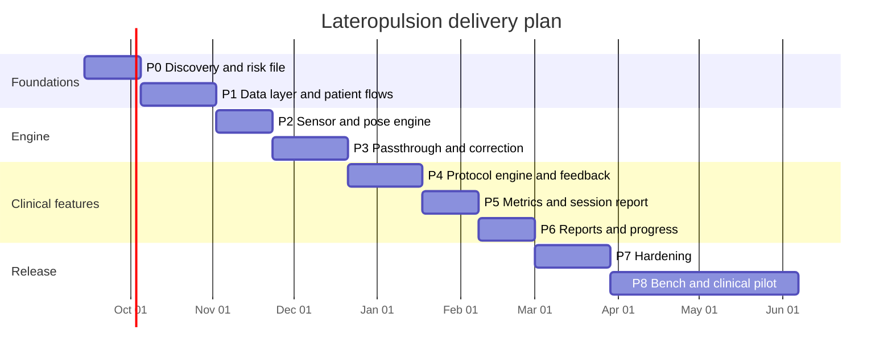

# Lateropulsion — Phase-by-Phase Implementation Plan

Companion to [`README.md`](./README.md) and [`ARCHITECTURE.md`](./ARCHITECTURE.md).

Ten phases, roughly 36 weeks to a completed feasibility pilot with a two-to-four person team. Each phase has **objectives, tasks, deliverables, exit criteria and risks**. No phase is considered complete until its exit criteria are demonstrably met — this is what makes the plan auditable rather than aspirational.

---

## Milestone overview

| Phase | Theme | Duration | Milestone |
|---|---|---|---|
| **0** | Discovery, clinical protocol, risk file | 3 wks | M0 — Requirements + risk file baselined |
| **1** | Foundation: data layer, patient and baseline flows | 4 wks | M1 — Register a patient and capture a baseline |
| **2** | Sensor and pose engine | 3 wks | M2 — Roll accuracy verified on the jig |
| **3** | Stereo passthrough + visual correction | 4 wks | M3 — Wearable prototype, latency measured |
| **4** | Protocol engine + real-time feedback | 4 wks | M4 — A full guided session runs end to end |
| **5** | Metrics engine + session report | 3 wks | M5 — Report generated and verified against ground truth |
| **6** | Reports module + long-term progress | 3 wks | M6 — Multi-session progress dashboard |
| **7** | Safety, security, usability hardening | 4 wks | M7 — Release candidate, risk controls verified |
| **8** | Bench validation + clinical feasibility pilot | 8–12 wks | M8 — Pilot data, safety and feasibility report |
| **9** | Scale: sync, FHIR, multi-site, ML | ongoing | M9 — Multi-site capable |



---

## Team and roles

| Role | Allocation | Responsibility |
|---|---|---|
| Android/graphics engineer | Full time | Engine, render, sensor, app |
| Full-stack / data engineer | 0.5–1.0 | Data layer, metrics, reports, tooling |
| Clinical lead (physiotherapist / neurologist) | 0.2–0.3 | Protocols, scales, safety, pilot |
| Regulatory / QA consultant | 0.1–0.2, spiking at P0 and P7 | Risk file, IEC 62304 evidence, ethics pack |
| UX designer | 0.3 in P1–P4, 0.5 in P7 | Clinician flows, usability engineering |

---

## Definition of done (applies to every task)

- [ ] Code reviewed by a second person
- [ ] Unit tests for all pure logic; instrumented tests for platform code
- [ ] Requirement ID referenced in the test name (`REQ-MET-014_episode_hysteresis`)
- [ ] No new SOUP without a `docs/traceability/soup.md` entry
- [ ] No PHI in logs (CI log-scanner passes)
- [ ] Risk file updated if the change touches a risk control
- [ ] Documentation updated in the same PR
- [ ] Builds green on CI, lint and detekt clean

---

# Phase 0 — Discovery, clinical protocol and risk file
**3 weeks · Milestone M0**

Do not skip this phase. Everything downstream — including whether Mode B is ethical to run at all — is decided here.

### Objectives
Establish the clinical grounding, the requirement set, the risk file, and the regulatory route before writing production code.

### Tasks

**Clinical**
- [ ] Literature review: lateropulsion mechanisms, SPV vs SVV findings, existing visual-feedback and VR interventions, effect sizes. Written into `docs/clinical/literature.md` with primary citations.
- [ ] Confirm the therapeutic rationale for Mode A and the experimental status of Mode B with the clinical lead **in writing**.
- [ ] Select and license clinical scales (SCP, BLS, FAC, TCT, Berg, PASS, SSQ). Confirm copyright/permission for each — some scales are not freely redistributable.
- [ ] Draft 3–5 exercise protocols with the clinical lead, including progression gates and stop rules.
- [ ] Observation sessions: watch 3–5 real lateropulsion therapy sessions. Document the actual workflow, not the idealised one.
- [ ] Define the contraindication and screening checklist.

**Requirements and risk**
- [ ] Write the requirement register (`docs/traceability/requirements.md`) with IDs: `REQ-PAT-*`, `REQ-SES-*`, `REQ-MET-*`, `REQ-SAF-*`, `REQ-SEC-*`, `REQ-RPT-*`.
- [ ] ISO 14971 hazard analysis: fall, cybersickness, wrong-patient, measurement error, data breach, over-reliance on the device, delayed care due to false reassurance. Severity × probability, with risk controls mapped to requirement IDs.
- [ ] Software safety classification per IEC 62304 (provisional Class B) with written justification.
- [ ] Usability engineering plan per IEC 62366-1; identify use-related hazards.

**Regulatory and ethics**
- [ ] Engage a regulatory consultant; confirm the CDSCO route for India and the classification.
- [ ] Draft the Institutional Ethics Committee submission and CTRI pre-registration plan.
- [ ] Draft the informed consent form, with a **separate consent item for video/screenshots**.
- [ ] Data protection impact assessment under the DPDP Act 2023.

**Technical**
- [ ] Hardware selection: shortlist 3 phones and 2 headsets; benchmark camera latency, gyro rate, thermal behaviour.
- [ ] Build a throwaway spike: camera → GL texture → rotate by IMU roll. **Wear it.** Judge sickness and latency subjectively before committing to the architecture.
- [ ] Specify and build the rotary calibration jig.
- [ ] Repository, CI, branch protection, ADR template, coding standards.

### Deliverables
`docs/clinical/` (literature, protocols, contraindications, consent) · `docs/risk/hazard-analysis.xlsx` · `docs/traceability/requirements.md` · hardware selection report · latency spike + written verdict · jig · CI skeleton

### Exit criteria
- Clinical lead signs off on protocols and on Mode A as default.
- Risk file baselined with every hazard having at least one identified control.
- Chosen phone measures < 55 ms motion-to-photon in the spike.
- Ethics submission drafted.

### Risks
| Risk | Mitigation |
|---|---|
| Mode B proves nauseating even in the spike | Ship Mode A only; Mode B becomes a research toggle. **Decide this now, not in Phase 8** |
| Scale licensing blocks redistribution | Use freely licensed scales; enter proprietary scores manually without embedding the instrument |
| No phone meets the latency target | Re-scope to a standalone OpenXR headset; recost |

---

# Phase 1 — Foundation: data layer, patient and baseline flows
**4 weeks · Milestone M1**

### Objectives
A working app that registers patients, records structured clinical baselines, and stores everything encrypted — with no VR yet.

### Tasks
- [ ] Gradle multi-module skeleton per `ARCHITECTURE.md` §11; Hilt wiring; build flavours (`clinicalDebug`, `clinicalRelease`, `syncRelease`).
- [ ] `core:model` domain entities as pure Kotlin data classes with validation.
- [ ] `core:database`: Room schema, SQLCipher integration, Keystore key management, migration test harness (`MigrationTestHelper` from v1 onward — retrofitting migrations is misery).
- [ ] Audit log: append-only DAO, write on every read/write/export/delete of patient data.
- [ ] Clinician auth: local account, PIN + BiometricPrompt, auto-lock, session timeout.
- [ ] Dashboard screen (Treatment | Reports) with device self-check (camera, IMU, storage, battery, thermal).
- [ ] New Patient flow: registration form, ID generation (`LP-YYYY-NNNN`), duplicate detection, identity table separation.
- [ ] Clinical baseline form: severity, head/trunk deviation, balance, walking, assistance, midline awareness, correction ability, fall risk.
- [ ] Scale engine: load versioned JSON scale definitions, render items dynamically, compute totals, store with `scale_version`.
- [ ] Existing Patient lookup: search by ID/name, profile view, history list.
- [ ] Config loader with schema validation for `config/*.json`.
- [ ] `FLAG_SECURE`, recents-screen blanking, no PHI in logs (add the CI lint rule now).
- [ ] Seeded test data generator for development.

### Deliverables
Installable app: register a patient, complete an assessment, view the profile. Encrypted DB verified. Audit log populated.

### Exit criteria
- Register → assess → retrieve round-trips correctly.
- DB file is unreadable without the key (verify by pulling the file and attempting to open it).
- Migration test passes v1 → v2 on a synthetic schema bump.
- Unit coverage on `core:model` ≥ 90 %.

### Risks
| Risk | Mitigation |
|---|---|
| SQLCipher + Room integration friction | Spike in week 1, not week 4 |
| Form scope creep | Freeze the baseline form against Phase 0 requirements; changes need a requirement update |

---

# Phase 2 — Sensor and pose engine
**3 weeks · Milestone M2**

### Objectives
Trustworthy angle measurement. **This is the measurement device; everything else is presentation.** If this phase is wrong, the entire product reports confident nonsense.

### Tasks
- [ ] `ImuSource`: register accel/gyro at `SENSOR_DELAY_FASTEST`, request 200 Hz, timestamp with `elapsedRealtimeNanos`, measure the actual achieved rate per device.
- [ ] Complementary filter in Kotlin first (testable), then port the hot loop to C++/JNI if profiling requires it. Do not start in C++.
- [ ] Quaternion utilities: multiply, normalise, exp/log, to-Euler, slerp — with property-based tests.
- [ ] Roll extraction per `ARCHITECTURE.md` §6.2, including the `PITCH_OUT_OF_RANGE` validity guard.
- [ ] Gyro bias estimation on a 3 s stillness window; continuous drift monitoring.
- [ ] Cross-check against `TYPE_GAME_ROTATION_VECTOR`; log disagreement events.
- [ ] Calibration flows: device profile (jig-derived `s`, `θ_mount`), gyro bias, patient midline `θ_ref` with therapist confirmation.
- [ ] Mount-shift detection (step in `θ_head` unexplained by the gyro integral).
- [ ] `PoseProvider` API: lock-free triple-buffered latest pose + a `Flow<PoseSample>` for consumers.
- [ ] Allocation-free verification test on the fusion loop.
- [ ] **Jig verification harness**: drive the jig through ±40° in 5° steps (static) and 0.5/1/2 Hz sinusoids (dynamic); compute error, RMS, hysteresis, and Bland–Altman agreement in `tools/jig/analyse.py`.
- [ ] Live debug screen: numeric roll, angle dial, raw traces, sample rate, drift, validity flags.

### Deliverables
`engine:sensor` module · device profiles for the shortlisted phones · **jig accuracy report** · debug screen

### Exit criteria
- Static roll error: **RMS ≤ 1.0°, max ≤ 2.0°** across ±40° on every qualified device.
- Dynamic error at 1 Hz: RMS ≤ 2.0°.
- Drift < 0.5°/min over a 20-minute static hold.
- Effective pose rate ≥ 100 Hz on every qualified device.
- Sign constant `s` resolved unambiguously by the calibration routine.

### Risks
| Risk | Mitigation |
|---|---|
| Vendor sensor quirks (rate lying, axis differences) | Per-device profiles; qualification gate; refuse unqualified devices |
| Head-tilt-as-trunk-proxy invalidity | Document the limitation; design the multi-stream data model now; plan the sternum-IMU study in Phase 9 |
| `θ_ref` set inconsistently between therapists | Guided procedure, on-screen instruction, record who set it, show it on every report |

---

# Phase 3 — Stereo passthrough and visual correction
**4 weeks · Milestone M3**

### Objectives
A wearable prototype: comfortable stereo passthrough, gravity-locked overlays, and a working, safe Mode B correction.

### Tasks
- [ ] Camera2 pipeline: `SurfaceTexture` external OES, `TEMPLATE_PREVIEW`, AE/AWB lock option, 60 fps mode where available, frame-timing telemetry.
- [ ] EGL context and dedicated render thread with `Choreographer` scheduling.
- [ ] Stereo rendering: dual viewport, configurable IPD, per-eye optical centre.
- [ ] Barrel/pincushion distortion mesh + chromatic aberration correction; coefficients per headset profile.
- [ ] Interactive lens/IPD calibration screen.
- [ ] Correction shader per `ARCHITECTURE.md` §7.2: rotation about the optical centre, over-scan crop, neutral fill outside the valid region, lateral shift term.
- [ ] Pose prediction to photon time, clamped; slew limit on `k·θ`.
- [ ] Overlay layer: plumb line, horizon, tolerance band, target, deviation readout, progress ring — all gravity-locked, all toggleable per cue set.
- [ ] Audio pan cue and haptic cue implementations.
- [ ] **Abort path**: therapist tap / Bluetooth clicker / long-press → neutral passthrough within one frame, bypassing the protocol layer entirely.
- [ ] Render watchdog and `PERF_DEGRADED` handling.
- [ ] Thermal monitoring with graceful resolution reduction.
- [ ] Latency measurement rig (photodiode or 240 fps camera) and a documented measurement procedure.
- [ ] Shader golden-image tests at known angles.

### Deliverables
Wearable prototype · headset profiles · **measured latency report** · shader test suite

### Exit criteria
- Motion-to-photon ≤ 45 ms measured on the primary device.
- Dropped frames < 1 % over a 20-minute run.
- Abort reaches neutral passthrough in ≤ 1 frame, verified by capture.
- Three healthy volunteers wear the prototype for 15 minutes in Mode A with SSQ scores below the site threshold.
- Overlay vertical stays true within 1° across ±30° of head roll (measured against a physical plumb line).

### Risks
| Risk | Mitigation |
|---|---|
| Cybersickness in Mode B | Seated only, `k ≤ 0.4`, ≤ 3 min, slew limiting, over-scan, SSQ gating. If volunteers still get sick, Mode B is shelved |
| Thermal throttling in 20 min | Lower preview resolution, disable unused sensors, thermal abort, consider a fan-cooled headset |
| Distortion tuning is fiddly | Time-box; ship a conservative profile; a slightly imperfect distortion is far better than a delayed prototype |

---

# Phase 4 — Protocol engine and real-time feedback
**4 weeks · Milestone M4**

### Objectives
A complete guided session: pre-check → calibration → blocks → rest → summary, with feedback and safety enforcement.

### Tasks
- [ ] Protocol JSON schema + validator; load and version `config/protocols/*.json`.
- [ ] `ProtocolEngine` implementing the session state machine (`ARCHITECTURE.md` §9.2), fully unit-tested with simulated clocks.
- [ ] Block sequencing: duration, targets, tolerance, rest intervals, checkpoints, per-block abort conditions.
- [ ] Progression gates: sitting → standing → walking enforcement, with an audited therapist override.
- [ ] Gain schedules: `Linear`, `PerformanceDriven`, `Manual`; invariant enforcement (no unexplained increases, Mode B requires a fading schedule).
- [ ] Pre-session checklist screen: supervision attestation, harness confirmation for standing, hygiene, battery, contraindication re-check.
- [ ] Live session screen (therapist-facing): current angle, band status, block progress, episode count, abort button, checkpoint marker, balance-loss marker.
- [ ] Therapist mirror view over a second screen (cast) or a post-hoc replay — decide based on Phase 0 observations.
- [ ] Audio instruction prompts per block; language-configurable strings.
- [ ] Rest-interval enforcement and the hard session cap.
- [ ] SSQ pre/post capture screens.
- [ ] Session persistence: `.lpx` writer with the ring buffer, batched flush, hash trailer, crash-recovery routine.
- [ ] Exercises 1–5 implemented; 6–7 stubbed behind the walking gate.
- [ ] SVV test module (rotating line, method of adjustment, N trials, error and variance).

### Deliverables
End-to-end runnable session · protocol library v1 · `.lpx` writer + recovery · SVV module

### Exit criteria
- A full 15-minute multi-block session runs without intervention and saves correctly.
- Killing the app mid-session recovers a valid, correctly-metricised partial session.
- Progression gates cannot be bypassed without an audited override.
- Mode B refuses to start without a fading schedule.
- State-machine unit tests cover every transition including all abort paths.

### Risks
| Risk | Mitigation |
|---|---|
| Therapist cannot see what the patient sees | Prioritise the mirror view or the replay; this drives clinical acceptance more than any metric |
| Protocol schema churn | Version from day one; write a migration for every schema change |

---

# Phase 5 — Metrics engine and session report
**3 weeks · Milestone M5**

### Objectives
Turn raw traces into numbers a clinician can trust, and a report they will actually read.

### Tasks
- [ ] `MetricsAccumulator`: streaming MAD, RMS, max, SD, Welford variance, path length, time-in-band, symmetry index.
- [ ] `EpisodeDetector`: hysteresis state machine with min-duration, partial-episode handling.
- [ ] Recovery-time computation.
- [ ] Filter implementations: causal 2nd-order for live, zero-phase 4th-order Butterworth for summaries; filter parameters written into the session record.
- [ ] Validity masking: exclude `PITCH_OUT_OF_RANGE`, `TRACKING_LOST`, post-`MOUNT_SHIFT` segments; report `valid_sample_pct` prominently.
- [ ] Baseline comparison with the same-exercise/same-position guard and the low-confidence rule.
- [ ] Minimal detectable change: derive from the jig study plus a within-session test–retest study; draw it on every trend.
- [ ] `SessionSummarizer`: per-block and per-session summaries, version-stamped.
- [ ] **Synthetic trace generator** with known ground-truth metrics; golden-file tests against an independent Python implementation.
- [ ] Session summary screen: metrics, deviation plot, episode shading, checkpoints, therapist notes, assistance level, SSQ.
- [ ] PDF session report per `ARCHITECTURE.md` §12.1, with the head-as-proxy limitation printed on every report.
- [ ] CSV / JSON / Parquet exporters, de-identified by default.

### Deliverables
`feature:metrics` · `feature:report` · session summary screen · PDF template · exporters · **metric verification report**

### Exit criteria
- Every metric matches the independent Python implementation to within floating-point tolerance on ≥ 20 synthetic traces.
- Metrics on a jig-driven known trace match the commanded values within the Phase 2 accuracy bound.
- PDF generates in ≤ 2 s and renders correctly on the target print size.
- Reports refuse invalid baseline comparisons.
- Two clinicians read a sample report without assistance and correctly answer "did this patient improve, and how much help were they getting?"

### Risks
| Risk | Mitigation |
|---|---|
| Improvement % misread as a clinical outcome | Explicit label, MDC line, gain trace on the same chart, clinician-facing wording reviewed by the clinical lead |
| Metric definitions drift between app and analysis scripts | Single source of truth in the domain layer; golden files in CI |

---

# Phase 6 — Reports module and long-term progress
**3 weeks · Milestone M6**

### Objectives
The Reports half of the dashboard: everything a clinician needs about one patient across time.

### Tasks
- [ ] Patient search by ID/name/date, with recent list.
- [ ] Patient profile view: demographics, diagnosis, baseline, consent flags, session count.
- [ ] Session history list with status chips (completed / aborted / low-confidence / crash-recovered).
- [ ] Progress dashboard: MAD/RMS/TIB5 trend with the baseline reference line, gain `k` on a secondary axis, assistance level as a stepped line, clinical scale scores overlaid, MDC band shaded.
- [ ] Per-exercise sub-trends and per-checkpoint comparison.
- [ ] Session-vs-session comparison view (pick any two).
- [ ] Media gallery (consent-gated, encrypted, retention-aware).
- [ ] Clinical notes timeline.
- [ ] Progress report PDF; bulk CSV/Parquet export for research.
- [ ] Retention worker with clinician-confirmed deletion.
- [ ] Patient erasure flow (identifiers + media removed, de-identified series optionally retained per consent).

### Deliverables
Reports module · progress dashboard · progress PDF · export pipeline · retention and erasure flows

### Exit criteria
- A 10-session synthetic patient renders a correct, readable trend.
- Export round-trips: exported CSV re-imported into the analysis notebook reproduces the in-app metrics exactly.
- Erasure verified: no identifier recoverable from the DB or filesystem afterwards.
- Every report view is audit-logged.

### Risks
| Risk | Mitigation |
|---|---|
| Trend charts imply causation from a small n | MDC band, confidence labelling, wording reviewed by the clinical lead |
| Chart performance with long histories | Downsample for display; keep full data for export |

---

# Phase 7 — Safety, security and usability hardening
**4 weeks · Milestone M7**

### Objectives
Turn a working prototype into something safe enough to put on a patient.

### Tasks

**Safety**
- [ ] Verify every ISO 14971 risk control with a linked test; close the traceability matrix.
- [ ] Failure-mode implementation and testing per `ARCHITECTURE.md` §15 — camera stall, IMU dropout, mount shift, thermal, battery, storage, crash, clock change.
- [ ] Fault injection suite: kill the camera, starve the IMU, fill storage, force thermal throttle, kill the process mid-block.
- [ ] Confirm-identity step before the first block; persistent patient banner.
- [ ] Stop-rule prompts and the SSQ gating rule (two flagged scores → locked to Mode A).
- [ ] Contraindication re-check on every session start.

**Security**
- [ ] Third-party security review or, at minimum, a documented internal review against the §14 threat model.
- [ ] Verify: Keystore/StrongBox use, auto-lock, `FLAG_SECURE`, no exported components, no PHI in logs or crash reports, no `INTERNET` permission in the clinical flavour.
- [ ] SBOM generation, dependency scanning, SOUP list finalised with anomaly review.
- [ ] Penetration test of the sync flavour if it exists by now.

**Usability (IEC 62366-1)**
- [ ] Formative usability testing with 5+ therapists on the full workflow.
- [ ] Use-error analysis: what happens when the therapist sets the wrong gain, picks the wrong patient, skips the harness, mis-sets `θ_ref`? Design each error out or make it visible.
- [ ] Summative usability validation with 8+ representative users; document results.
- [ ] Accessibility: contrast, touch target size, font scaling, glove operation.
- [ ] Printed quick-start card and in-app training mode with a simulated patient.

**Quality**
- [ ] Soak testing: 10 consecutive 20-minute sessions, thermal and battery logged.
- [ ] Crash-free rate target ≥ 99.5 % over the test campaign.
- [ ] Release process: signed builds, version stamping, release notes, IEC 62304 release evidence pack.

### Deliverables
Closed traceability matrix · fault-injection results · security review report · usability engineering file · training mode · **release candidate build**

### Exit criteria
- 100 % of risk controls verified with linked evidence.
- No open high or critical security findings.
- Summative usability shows no unmitigated use error with a safety consequence.
- Soak test passes without thermal abort or crash.
- Ethics approval granted and CTRI registration complete.

### Risks
| Risk | Mitigation |
|---|---|
| Usability testing exposes a workflow flaw late | Run formative testing during Phase 4, not only here |
| Ethics approval delays the pilot | Submit at the end of Phase 5; iterate during Phase 6–7 |

---

# Phase 8 — Bench validation and clinical feasibility pilot
**8–12 weeks · Milestone M8**

### Objectives
Evidence. Does the device measure what it claims, is it tolerable, is it feasible in a real ward, and is there any signal worth a larger trial?

### 8a — Bench and healthy-volunteer validation (2–3 weeks)
- [ ] Full jig re-verification on final hardware and final software.
- [ ] Concurrent validity: device roll vs a reference system (optical motion capture or a calibrated inclinometer) across postures. Report Bland–Altman limits of agreement and ICC.
- [ ] Test–retest reliability in healthy volunteers (n ≈ 15): compute standard error of measurement and **minimal detectable change** — this is the number that makes every future improvement claim interpretable.
- [ ] Tolerability in healthy volunteers: SSQ before/after Mode A and Mode B, 15-minute exposures.
- [ ] Inter-rater reliability of the `θ_ref` midline-setting procedure between therapists.

### 8b — Clinical feasibility pilot (6–9 weeks)
Design (to be finalised with the clinical lead and the ethics committee):

| Element | Proposal |
|---|---|
| Design | Single-arm, prospective feasibility study; device sessions **in addition to**, never instead of, standard care |
| Population | Sub-acute stroke inpatients with SCP ≥ 1 or BLS ≥ 2, medically stable, able to consent or with a legal representative |
| n | 10–15 |
| Dose | Up to 5 sessions/week, ≤ 20 min headset time, 2–4 weeks |
| Primary endpoints | **Feasibility** (sessions completed / planned, dropout) and **safety** (adverse events, falls, SSQ) |
| Secondary | Change in SCP/BLS, device MAD/TIB5 vs baseline, FAC, assistance level, therapist and patient acceptability |
| Analysis | Descriptive; effect estimates with confidence intervals, explicitly labelled hypothesis-generating |
| Stopping rules | Any device-related fall, or nausea in > 30 % of sessions, triggers a review |

Tasks:
- [ ] Site training and competency sign-off for every therapist.
- [ ] Run-in with 2 patients; review protocol adherence and workflow friction before enrolling further.
- [ ] Weekly safety review with the clinical lead.
- [ ] Data monitoring: valid-sample %, missing sessions, protocol deviations.
- [ ] Structured therapist interviews and patient acceptability questionnaires.
- [ ] Lock the database; analyse; write the feasibility report.

### Deliverables
Validation report (accuracy, reliability, MDC) · tolerability report · pilot dataset and statistical report · therapist acceptability findings · prioritised change list for v2 · manuscript draft

### Exit criteria
- ≥ 70 % of planned sessions completed.
- No device-related serious adverse events.
- MDC established and published in the reports.
- A clear, evidence-based decision on Mode A vs Mode B for v2.

### Risks
| Risk | Mitigation |
|---|---|
| Recruitment shortfall | Multi-ward or two-site recruitment; realistic eligibility criteria |
| Patients cannot tolerate the headset | This is itself a valid feasibility finding — report it honestly; consider a lighter headset or shorter blocks |
| Device metrics do not correlate with SCP/BLS | Expected to some degree (head vs trunk); report it, and prioritise the trunk IMU |

---

# Phase 9 — Scale
**Ongoing · Milestone M9**

Prioritise from Phase 8 findings, not from this list.

- [ ] **Trunk IMU** (BLE sternum sensor) — likely the single highest-value addition, given the head-as-proxy limitation.
- [ ] Backend sync, multi-site support, row-level security, FHIR gateway to hospital EMRs.
- [ ] Clinician web dashboard for cross-patient and cross-site views.
- [ ] Standalone OpenXR headset port (Quest 3 / Pico): better latency, real 6DoF, no thermal problem.
- [ ] iOS port via Kotlin Multiplatform for shared domain logic.
- [ ] Adaptive protocols: automatic difficulty and gain adjustment from within-session performance.
- [ ] Gamified functional tasks to improve engagement and session adherence.
- [ ] Predictive modelling of recovery trajectory — **only** with adequate n and external validation, and never surfaced as a prognosis to a patient.
- [ ] Home/step-down mode, gated on a demonstrated safety case (this is a substantially harder regulatory and safety problem than the inpatient use case, and should not be assumed).
- [ ] Full RCT if the feasibility signal justifies it.
- [ ] Regulatory submission (CDSCO first, then CE/FDA as the market strategy dictates).

---

## Cross-cutting workstreams

Running throughout, not confined to a phase:

| Workstream | Cadence |
|---|---|
| Risk file updates | Every phase, and on any change touching a risk control |
| Traceability matrix | Every requirement gets a test before its phase closes |
| SOUP list | On every dependency change |
| Clinical review | Fortnightly with the clinical lead |
| Usability feedback | Formative from Phase 4 onward |
| Documentation | Same PR as the code |
| Security | Threat-model review at the end of each phase |

---

## Phase-gate checklist template

Copy into `docs/gates/phase-N.md` at each gate.

```
PHASE N GATE REVIEW
Date:                     Attendees:

[ ] All exit criteria met and evidenced (link each)
[ ] Requirements traceability updated
[ ] Risk file updated; new hazards assessed and controlled
[ ] SOUP list current
[ ] Test results attached; all critical defects closed
[ ] Documentation updated
[ ] Clinical lead sign-off (phases touching patient interaction)
[ ] Regulatory/QA sign-off (phases 0, 7, 8)
[ ] Known limitations recorded and communicated
[ ] Next-phase plan reviewed and resourced

Decision:  PROCEED  /  PROCEED WITH CONDITIONS  /  HOLD
Conditions:
Signatures:
```

---

## What would make this project fail

Worth reading before Phase 0, and again before Phase 8.

1. **Building Mode B first because it is the exciting part.** The evidence favours Mode A. Build the boring, defensible thing first.
2. **Treating head tilt as trunk lateropulsion.** They dissociate. Say so on every report, and plan the trunk sensor.
3. **Skipping the jig.** Without verified accuracy, every metric in every report is decoration.
4. **Letting `improvement_%` become the headline.** It is an internal metric on a proxy signal. SCP/BLS are the clinical outcomes.
5. **Under-resourcing the fall risk.** Occluding vision in a population defined by impaired balance is the central hazard of this product.
6. **Deferring the risk file and traceability.** Retrofitting IEC 62304 evidence costs multiples of writing it as you go.
7. **Designing for the therapist you imagine instead of the one you observed.** Do the ward observations in Phase 0.
